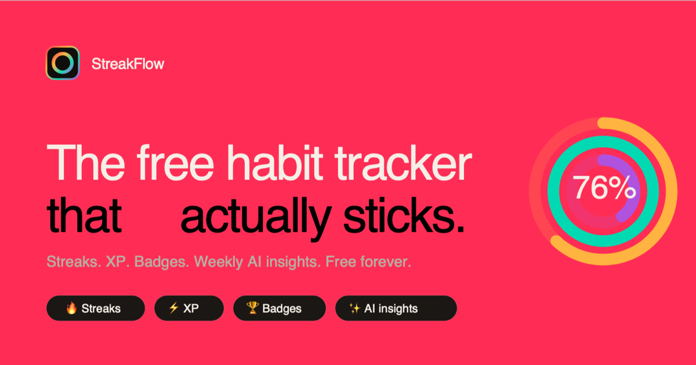

# StreakFlow — Free Habit Tracker with Streaks, XP & AI Insights

> The free, open-source habit tracker that actually sticks. Stacked progress
> rings, streaks, XP, badges, GitHub-style heatmaps, and weekly AI insights
> generated by Claude. No ads, no paywall.

**Live:** https://streakflow-app.netlify.app



[](LICENSE)
[](https://nextjs.org)
[](https://supabase.com)
[](https://app.netlify.com/start/deploy?repository=https://github.com/avinashchavan1/streakflow)

## Why StreakFlow

- **Free forever.** No paywall, no premium tier, no ads.
- **Open source.** MIT license. Audit it, fork it, self-host it.
- **Calm gamification.** Streaks, XP, badges — without the RPG cosplay.
- **AI insights.** Weekly patterns and predictions generated by Claude.
- **PWA.** Install on iOS, Android, or desktop. No app store.
- **Your data is yours.** Exportable. No lock-in. Row-level security.

## Feature comparison

| Feature | StreakFlow | Habitica | Streaks | Notion |
|---|---|---|---|---|
| Free forever | ✅ | ❌ | ❌ | ✅ |
| No ads | ✅ | ❌ | ✅ | ✅ |
| Open source | ✅ | ✅ | ❌ | ❌ |
| Streaks & freezes | ✅ | ✅ | ✅ | ❌ |
| GitHub-style heatmap | ✅ | ❌ | ❌ | ❌ |
| Weekly AI insights | ✅ | ❌ | ❌ | ❌ |
| PWA installable | ✅ | ❌ | ❌ | ❌ |

## Features

- **Streak tracking** — daily, weekday, weekend, custom schedules; freeze to
  protect a missed day
- **XP & levels** — Starter → Apprentice → Adept → … → Transcendent. Streak
  multipliers at day 7 (×1.5), 30 (×2), 100 (×3). Server-side trigger so
  XP can't be tampered with from the client
- **15 unlockable badges** — First Step, Three-peat, Iron Week, Fortnight
  Fighter, Monthly Master, Century Club, Hydration Hero, and more
- **Analytics** — 26-week heatmap, completion %, time-of-day patterns,
  by-weekday breakdown
- **AI insights** — patterns/predictions/correlations/notes from your last
  30 days, generated by Claude weekly
- **Habit types** — binary (yes/no), quantity (8 glasses), duration (30 min)
- **Apple-Fitness-style stacked rings** — one ring per habit, color-coded

## Tech stack

- Next.js 16 (App Router) · React 19 · Tailwind v4 · shadcn/ui · Zustand
- Supabase (Postgres + Row-Level Security + Auth)
- Anthropic Claude API for weekly insights
- Netlify deploy via `@netlify/plugin-nextjs`

## Quick start (self-host)

```bash
pnpm install
cp .env.example .env.local   # fill in Supabase + Anthropic keys
# Apply DB migrations in Supabase SQL editor:
#   supabase/migrations/001_initial_schema.sql
#   supabase/migrations/002_increment_xp_rpc.sql
#   supabase/migrations/003_xp_security.sql
#   supabase/seed.sql
# Disable email confirmation in Supabase Auth → Providers → Email
pnpm dev --port 3002
```

## Architecture highlights

- **XP awarded server-side** via Postgres trigger on `habit_logs`. Client
  can't mint XP — the trigger reads habit type + current streak and applies
  multipliers atomically.
- **Perfect-day bonus** also server-side. Idempotent via marker rows so the
  bonus can't be double-claimed.
- **RLS on every table.** `auth.uid()` is the only check; no service-role
  key shipped to the client.
- **OAuth callback** validates `next` param against same-origin paths
  (no open-redirect via `next=//evil.com`).
- **`increment_xp` RPC** enforces `caller = uid` and a 1000-cap. Verified
  via direct anon API call.

## Repository

- Code: this repo
- Issues: https://github.com/avinashchavan1/streakflow/issues
- Live demo: https://streakflow-app.netlify.app

## Keywords

`habit-tracker` `habit-tracker-app` `free-habit-tracker` `streak-app`
`open-source-habit-tracker` `daily-habit-tracker` `gamified-habit-tracker`
`habitica-alternative` `streaks-app-alternative` `pwa` `nextjs` `supabase`
`anthropic-claude` `ai-insights` `tailwindcss` `typescript` `zustand`

## License

[MIT](LICENSE) — free for personal and commercial use.
